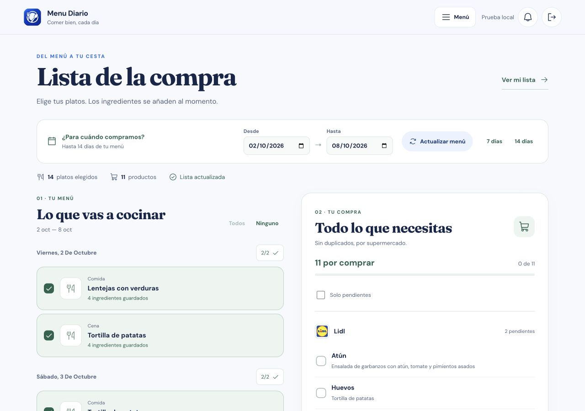
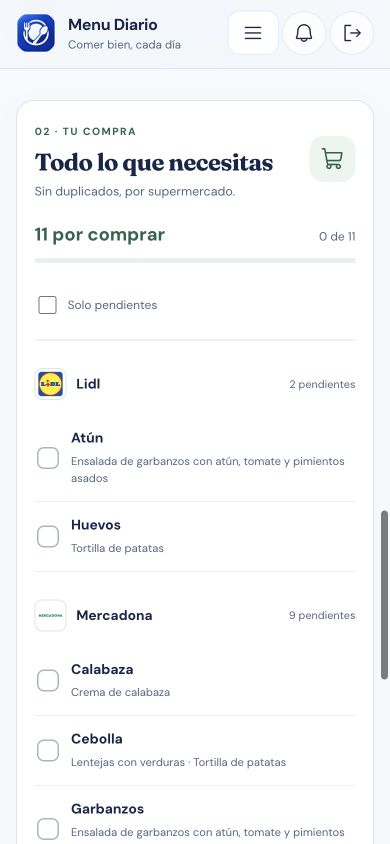

# Compra: rediseño y correcciones

2 de octubre de 2026.

La lista se calcula al seleccionar platos a partir de los ingredientes guardados. La IA se usa únicamente para completar platos sin ingredientes. Los platos se agrupan por día y tanto el menú como los productos usan el desplazamiento natural de la página. El catálogo de platos también pasa a tarjetas en pantallas de tamaño intermedio, sin desplazamiento horizontal.

## Comportamiento

- Rango independiente del planificador: 7 o 14 días, o fechas personalizadas hasta 14 días.
- Selección individual, por día y todos/ninguno. Actualizar el menú conserva las deselecciones de los platos que siguen presentes.
- Los ingredientes repetidos se unen y muestran sus platos de origen. Se mantienen los supermercados y exclusiones del usuario.
- Los platos comprados aparecen como productos completos.
- Los platos sin ingredientes se muestran expresamente; pueden completarse con IA o mediante su editor de ingredientes.
- Las marcas de comprado se asocian al nombre del producto, de modo que añadir ingredientes no desplaza esas marcas a otro producto.
- Copiar y Alexa usan solamente productos pendientes. Alexa conserva el flujo existente de copiar la orden y abrir la app; no se verifica la transferencia automática.
- Las marcas y la selección se conservan durante la sesión de la aplicación; no se guardan en el servidor.

## Backend

Cambios locales en `/Applications/MAMP/htdocs/OV2/api/menudiario.php` y nuevo helper `/Applications/MAMP/htdocs/OV2/api/MenudiarioShopping.php`.

La resolución de fichas con nombres duplicados prioriza la del usuario y sus ingredientes. La respuesta de la IA se asocia por nombre solicitado; se elimina la asignación por posición, que podía intercambiar ingredientes cuando la IA devolvía otro orden. Se solicitan lotes de cuatro platos. Una respuesta parcial o un fallo conserva los ingredientes disponibles y devuelve `missing_dishes`, `complete` y `warnings`.

El guardado de ingredientes permite los platos visibles del grupo y mantiene los ingredientes privados de cada usuario. El autocompletado acepta el catálogo de nombres que devuelve la API.

Para publicar la corrección completa deben desplegarse el frontend y ambos archivos PHP. No se han publicado cambios ni ejecutado operaciones contra datos reales durante esta revisión.

## Verificación

- `npm test`: seis pruebas de selección, duplicados, exclusiones, supermercados, platos comprados y actualización de selección.
- `php tests/backend-shopping.php /ruta/api/MenudiarioShopping.php`: siete comprobaciones de orden de respuestas, nombres omitidos/inesperados, datos inválidos y prioridad del catálogo.
- Build de Vite, ESLint, Oxlint y comprobación de sintaxis PHP.
- Navegador integrado con una copia temporal aislada y datos ficticios: selección, limpieza completa, marcas de comprado, rango de 14 días, edición manual, generación simulada y error simulado de IA.
- Revisión responsive a 320, 390, 800 y 1280 píxeles. Las capturas muestran datos ficticios.

No se ha verificado la conexión MySQL ni una generación real del proveedor de IA. Las comprobaciones del backend son pruebas de las reglas y validación de sintaxis, no una prueba autenticada del endpoint real.

## Capturas con datos ficticios

