# Revisión de diseño, usabilidad y accesibilidad

Fecha: 18 de septiembre de 2026.

Se conserva la identidad existente (Fraunces, DM Sans, azul y verde). Se ha revisado el frontend Vue, rutas, estilos, formularios, cliente API y configuración de instalación. Las capturas de los recorridos privados usan **datos ficticios**, servidos por un entorno temporal independiente en el puerto 5174; no se incorpora una vía de acceso de prueba a producción. No se han guardado cambios en datos reales.

## Recorrido y resultados

| Paso | Pantalla | Resultado y cambios |
| --- | --- | --- |
| 1 | Entrada | Identidad conservada; botón de Google bloqueado mientras inicia sesión. Salto al contenido disponible con teclado. |
| 2 | Platos | Tabla completa en escritorio y tarjetas en móvil. Acciones de 44 px, nombres largos ajustables, filtros recuperables, favoritos y página actual anunciados. |
| 3 | Editor de platos | Diálogo modal nativo con título accesible, foco contenido, Escape y devolución del foco. Pestañas con flechas, Inicio y Fin, panel asociado. |
| 4 | Ingredientes | Tarjetas móviles, columnas sin cabeceras solapadas, botón visible para limpiar filtros y estado de carga separado de catálogo vacío. |
| 5 | Planificador | Encabezado accesible y botones de edición identificados por fecha. Estado de error con reintento de carga. |
| 6 | Compra | Distribución móvil inspeccionada; se conserva la selección de platos existente. Generación con IA no probada contra el backend. |
| 7 | Calendario | Fechas completas en nombres accesibles, identificación de hoy e iconos solamente para comidas que realmente existen. |
| 8 | Tareas | Distribución móvil inspeccionada; filtros anuncian selección y acciones amplían su zona de interacción. |
| 9 | Tuppers | Pantalla vacía y editor inspeccionados a 320 px; filtros se distribuyen en dos filas en pantallas estrechas. No se guardaron tuppers. |
| 10 | Ajustes y Telegram | Incluidos en el contenido principal; etiquetas de invitación y código de grupo. El botón de volver conserva su texto en móvil. Integración Telegram no ejecutada. |
| 11 | Fusionar ingredientes | Selección inicial inspeccionada; sin desbordamiento horizontal a 390 px. No se ejecutó ninguna fusión. |

## Cambios transversales

- Diálogos nativos `showModal()` para impedir interacción con el fondo y contener el foco. Los cierres siguen respetando las protecciones de guardado de cada editor.
- Escape y clic fuera para cerrar paneles de navegación; apertura mutuamente exclusiva de menú y notificaciones.
- Título de documento por ruta y foco al contenido al cambiar de sección.
- Foco de mayor contraste, texto secundario más oscuro, controles móviles legibles y estilos para colores forzados. Se conservan las reglas existentes de movimiento reducido.
- Altura dinámica de los diálogos y posibilidad de desplazarse por su contenido en ventanas pequeñas.
- Consultas GET con límite de 20 segundos, cancelación, limpieza del temporizador y mensajes legibles para errores de red. Las escrituras no se reintentan automáticamente.
- La PWA deja de imponer orientación vertical para permitir el uso horizontal.

## Verificaciones

- `npm run build`: correcto.
- ESLint y Oxlint sobre `src`: correctos.
- `git diff --check`: correcto.
- Prueba aislada del cliente API: respuesta correcta, error de red, preservación del error HTTP y cancelación por tiempo de espera.
- Navegador integrado: capturas a 390 × 844 y 1280 × 900; inspección adicional del calendario y formulario de tuppers a 320 × 740.
- Pestañas del editor: Tab desde cerrar, flecha derecha hacia Ingredientes y Escape; el foco volvió a «Editar Lentejas con verduras».
- Navegación desde el menú a Ingredientes: título actualizado, menú cerrado y foco en `main-content`.
- Búsqueda sin resultados y botón de limpiar: la tabla reaparece.
- Sin errores de consola en el recorrido de prueba inspeccionado.
- Sesión real: verificado el mensaje de tiempo de espera, su cierre con Escape y la aparición del botón «Volver a intentar» en lugar de mantener la carga indefinida.

## Límites

El inicio de sesión real se completó, pero la carga de datos de la API local no se pudo validar durante la revisión. Las comprobaciones privadas se hicieron con datos ficticios y no acreditan guardado, generación con IA, envío de invitaciones, fusión, borrado ni integración con Telegram. No se ha realizado una auditoría formal WCAG ni una sesión con VoiceOver/NVDA; la verificación de accesibilidad combina código, árbol accesible e interacción por teclado. La instalación PWA y sus cambios de orientación requieren una comprobación en dispositivo.

## Capturas

### 2. Platos en móvil
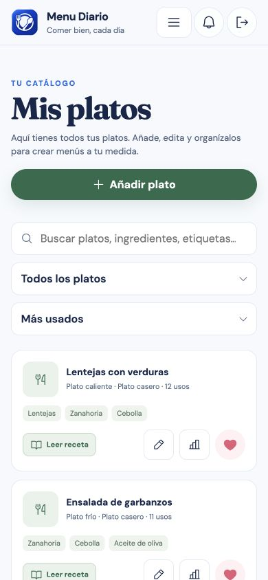

### 3. Editor con navegación por teclado
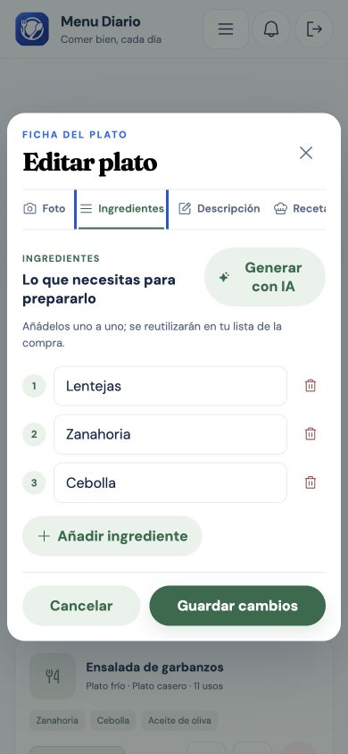

### 4. Ingredientes en móvil
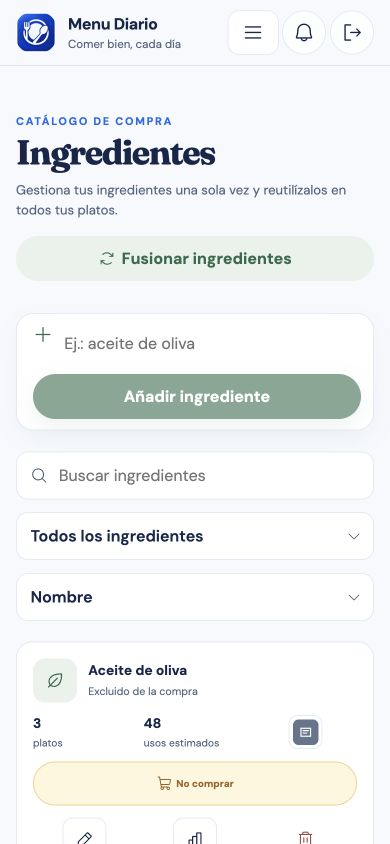

### 5. Planificador
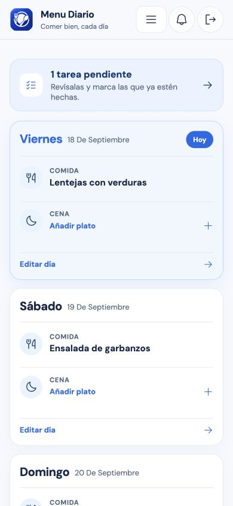

### 6. Compra
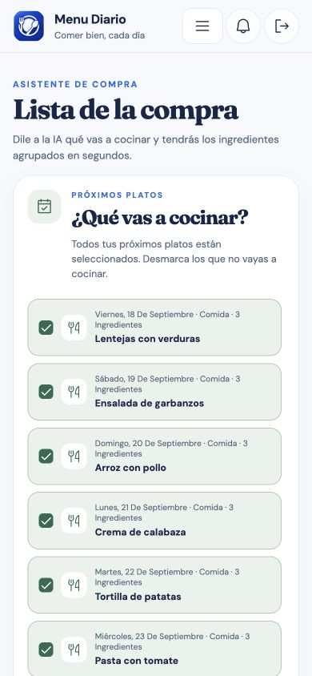

### 7. Calendario
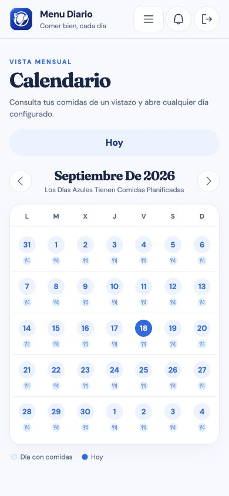

### 8. Tareas
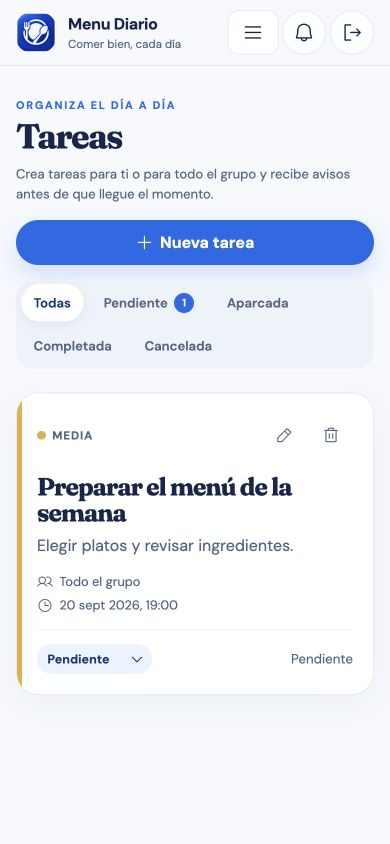

### 9. Tuppers
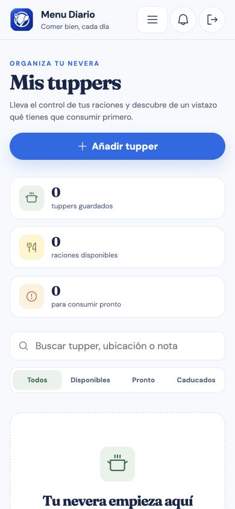

### 10. Ajustes
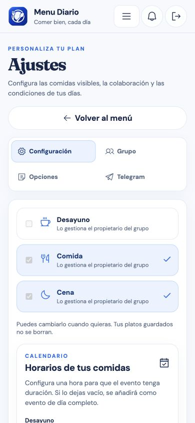

### 11. Fusión de ingredientes
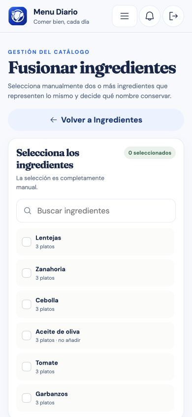

### Escritorio
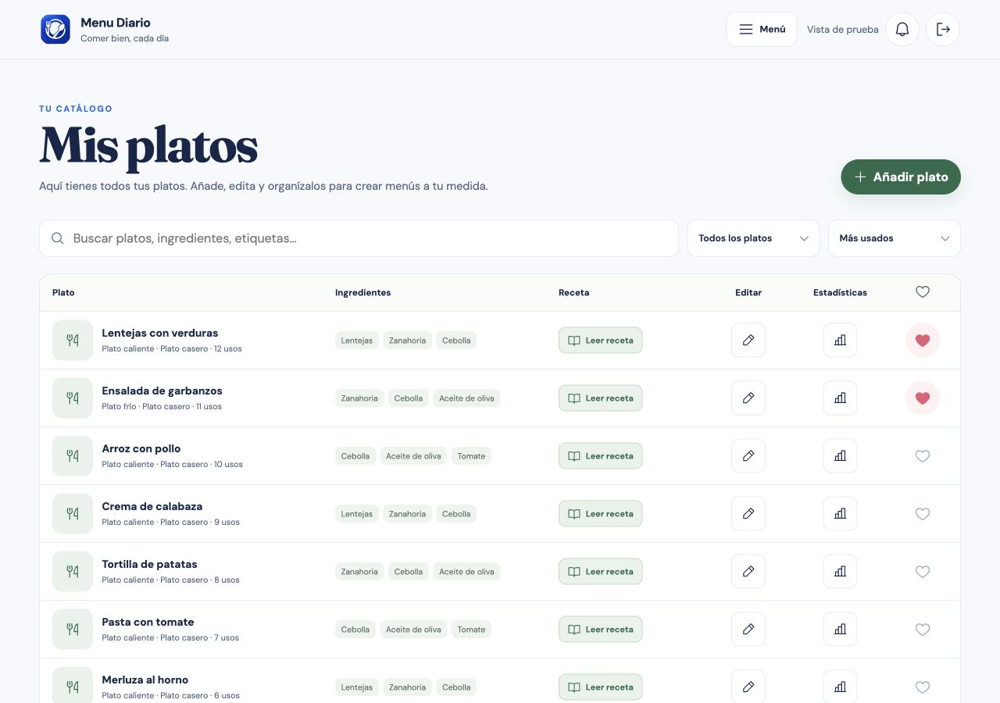
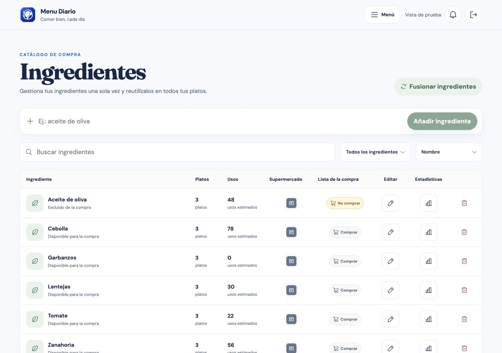

### Conexión real: error recuperable
Esta captura corresponde a la sesión real y documenta la falta de respuesta del servidor local.
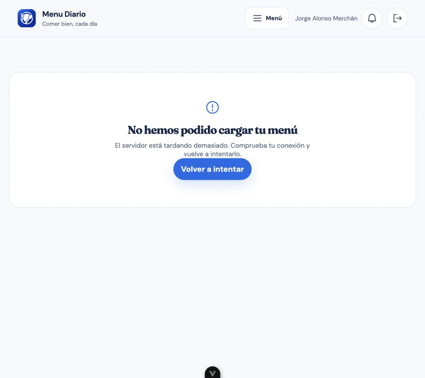
